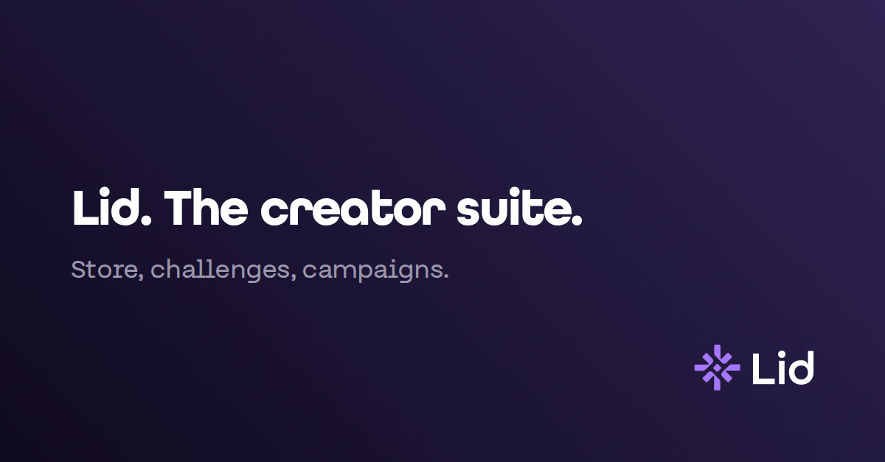

# Events and partners

### Listing blurb



Lid. The creator suite.

Store, challenges and campaigns in one place.



Lid. La suite del creador.

Tienda, retos y campañas en un solo lugar.



### Banners

Banners in five sizes, in English and Spanish. They are in the ZIP and the Google Drive folder on the Media kit page.

<figure><figcaption></figcaption></figure>

| Size        | Use                         | English                     | Español                     |
| ----------- | --------------------------- | --------------------------- | --------------------------- |
| 1500 × 500  | X header, web header        | lid-banner-en-1500x500.png  | lid-banner-es-1500x500.png  |
| 1200 × 627  | LinkedIn post, link preview | lid-banner-en-1200x627.png  | lid-banner-es-1200x627.png  |
| 1080 × 1080 | Square post                 | lid-banner-en-1080x1080.png | lid-banner-es-1080x1080.png |
| 1080 × 1920 | Story                       | lid-banner-en-1080x1920.png | lid-banner-es-1080x1920.png |
| 1920 × 1080 | Slide or screen             | lid-banner-en-1920x1080.png | lid-banner-es-1920x1080.png |

On your own page, use the logo that matches your background, white wordmark on dark and navy on light, and link it to lid.pro.
