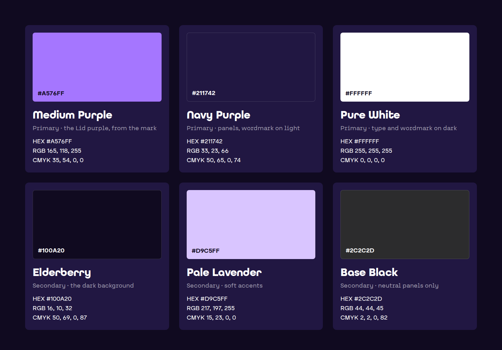

# Logo and brand

### Logo

The full logo for dark and light backgrounds, and the mark alone for small or square spaces.

<figure><figcaption></figcaption></figure>

| File                             | Use it on                        | Formats          |
| -------------------------------- | -------------------------------- | ---------------- |
| lid-logo-on-dark                 | Dark backgrounds: white wordmark | SVG, PNG         |
| lid-logo-on-light                | Light backgrounds: navy wordmark | SVG, PNG         |
| lid-mark                         | Small or square spaces           | SVG, PNG         |
| lid-avatar-navy, lid-avatar-dark | Profile pictures and app icons   | PNG, 1024 × 1024 |

All files are in the ZIP and the Google Drive folder on the Media kit page.

### Rules

* Use the files as they are. Never redraw, stretch, rotate or recolor them.
* The mark is always Medium Purple.
* The wordmark is white on dark backgrounds and navy on light ones. Never black.
* Keep the logo at least 55 px wide on screen.
* Leave at least 40 px of empty space between the Lid logo and any other logo.
* Place it on a plain background, never on a busy photo.

What not to do:

<figure><figcaption></figcaption></figure>

### Colors

The six brand colors, with the values for screen and print.

<figure><figcaption></figcaption></figure>

| Color         | HEX     | RGB           | CMYK          | Use                               |
| ------------- | ------- | ------------- | ------------- | --------------------------------- |
| Medium Purple | #A576FF | 165, 118, 255 | 35, 54, 0, 0  | The Lid purple, from the mark     |
| Navy Purple   | #211742 | 33, 23, 66    | 50, 65, 0, 74 | Panels, and the wordmark on light |
| Pure White    | #FFFFFF | 255, 255, 255 | 0, 0, 0, 0    | Type and the wordmark on dark     |
| Elderberry    | #100A20 | 16, 10, 32    | 50, 69, 0, 87 | The dark background               |
| Pale Lavender | #D9C5FF | 217, 197, 255 | 15, 23, 0, 0  | Soft accents                      |
| Base Black    | #2C2C2D | 44, 44, 45    | 2, 2, 0, 82   | Neutral panels only               |

Lid is dark first: most surfaces use Elderberry or Navy Purple, white type and one touch of Medium Purple. Text on Medium Purple is Elderberry, never white.

### Fonts

| Font             | Use                       | Get it                                                                                                                                                  |
| ---------------- | ------------------------- | ------------------------------------------------------------------------------------------------------------------------------------------------------- |
| All Round Gothic | Headlines                 | Licensed to Lid, so the files are not included. [Space Grotesk](https://fonts.google.com/specimen/Space+Grotesk) (free on Google Fonts) is the stand-in |
| Nadea            | Body text                 | Licensed to Lid, so the files are not included. [Inter](https://fonts.google.com/specimen/Inter) (free on Google Fonts) is the stand-in                 |
| JetBrains Mono   | Code and receipt IDs only | Free at [jetbrains.com/lp/mono](https://www.jetbrains.com/lp/mono/)                                                                                     |
