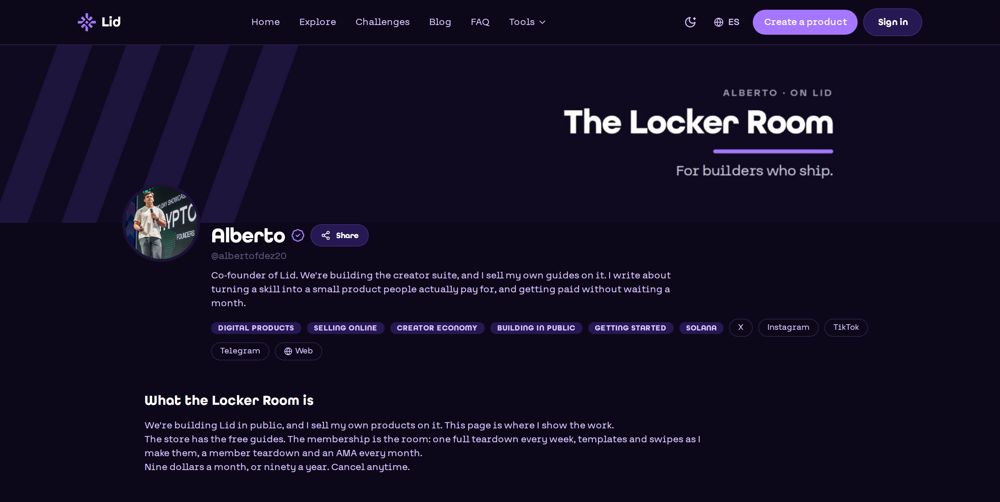
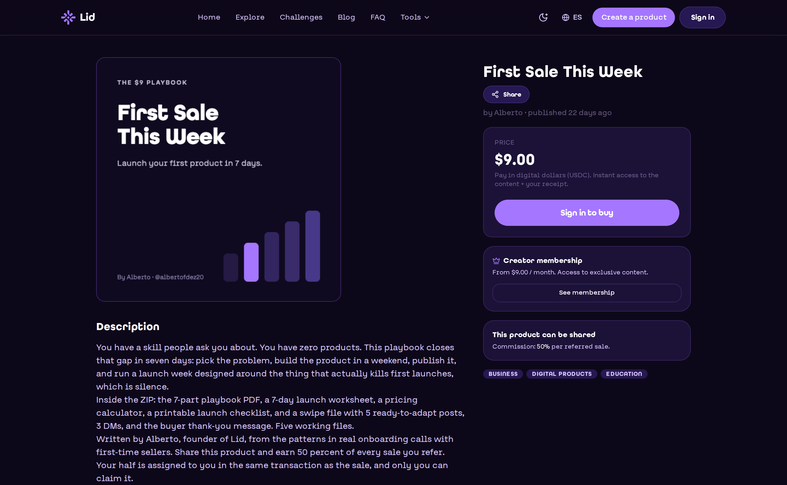
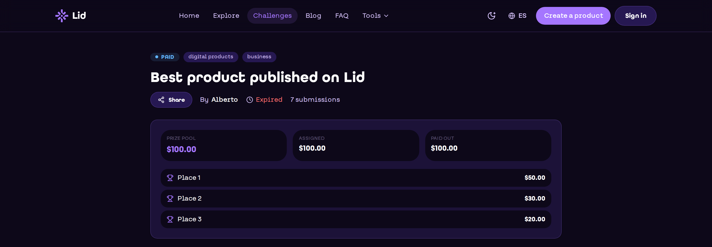
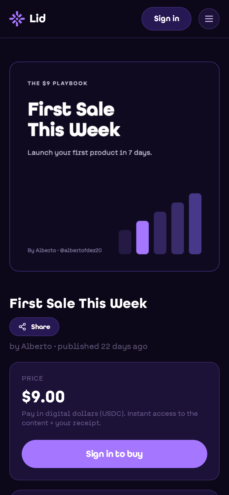
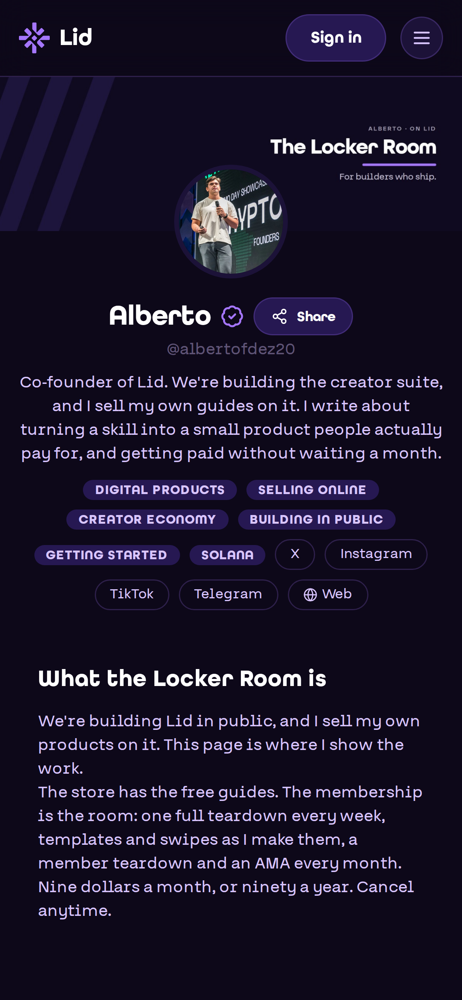

# Product screenshots

Every image is a real screen from lid.pro, captured on 30 September 2026 in a logged-out browser, the way a visitor sees it.

**Creator page.** A creator's page on Lid, the one link a creator shares.

<figure><figcaption></figcaption></figure>

**Product page.** The buyer pays in digital dollars and gets instant access and a receipt. Anyone can share the product and earn the cut the creator set.

<figure><figcaption></figcaption></figure>

**Memberships.** A monthly or yearly plan for members-only posts.

<figure><figcaption></figcaption></figure>

**Challenge.** A finished challenge: a $100 prize pool, assigned to three people who each claimed their prize.

<figure><figcaption></figcaption></figure>

**On a phone.** The same product page on a phone.

<figure><figcaption></figcaption></figure>

**On a phone.** The creator page on a phone.

<figure><figcaption></figcaption></figure>
